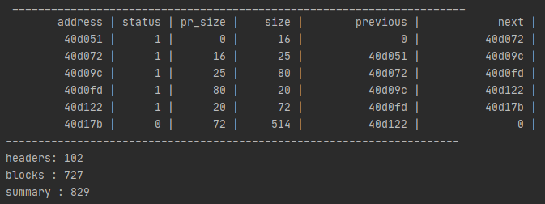
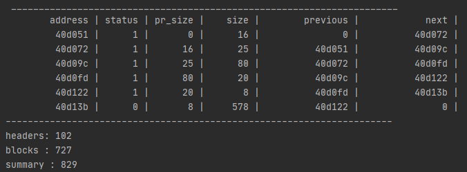
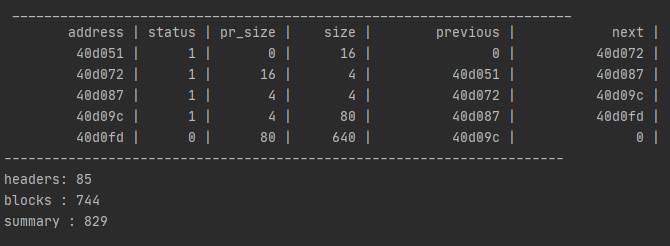

# LabaOS1: Memory Allocator
### Описание
Лабораторная работа по созданию аллокатора памяти на С++.
Реализация основана на байтовом массиве с целью изучения и тестирования алгоритма аллокации памяти.
Аллокация памяти предоставляет разработчику контроль над памятью, что позволяет не только оптимизировать использование памяти,
но и улучшить быстродействие программы по сравнению со стандартным сборщиком мусора.
### Описание алгоритма
Эта реализация использует указатели C ++ для перемещения между блоками в памяти.
Каждый блок состоит из двух частей: заголовка и данных.
Размер заголовка постоянный и равен 17 байтам.
Он состоит из 3 полей, в которых хранится информация о том, занят ли блок (1 байт),
размер части данных этого блока (8 байта) и размер предыдущего блока (8 байта).
#### void* memory_allocator(size_t size)
Эта функция выделяет новый блок памяти запрошенного размера.
Выполняет поставленную задачу за счет поиска лучшего решения.
memory_allocator просматривает всю память, чтобы найти наименьший пустой блок,
в котором достаточно памяти для выделения нового блока требуемого размера.
Этот подход обеспечивает рациональное использование памяти,
чтобы пользователь мог хранить как можно больший объем данных.
####void* memory_reallocator(void* pointer, size_t size)
Используйте его, когда вам нужно изменить размер определенного блока памяти.
`pointer` - указатель на блок, размер которого вы хотите изменить.
`size` - это новый размер этого блока.
##### Поведение
** Если запрошенный размер блока меньше текущего **,
текущий блок будет разделен на две части.
Первая часть размещается и возвращается в результате функции.
Второй также становится блоком, и выполняется операция mem_free,
чтобы освободить блок и объединить его со следующим блоком, если следующий блок пуст.
** Если запрошенный размер блока меньше текущего **, есть два возможных варианта:
- Если следующий блок в сочетании с текущим блоком дает больше места,
 чем достаточно для перераспределения, следующий блок разделяется на две части.
  Первая часть объединяется с первым блоком для создания нового блока необходимого размера. Вторая часть используется вместо начального второго блока.
- Если второй блок пуст и для его разделения не осталось места, два блока объединяются.
- если ни один из предыдущих вариантов не был возможен,
новый блок памяти выделяется с помощью `memory_allocator`, а текущий блок очищается.
#### void memory_free (void * addr)
Функция удаляет данные блока, помечает их как блок «свободной памяти» и
пытается объединиться с соседними блоками «свободной памяти», если они есть.
### Примеры использования
#### Аллокация 15 байтов
##### Пример кода
```
void* x = memory_allocate(15);
```
##### Console Output


#### Реаллокация блока из 72 до 7 байт
##### Пример кода
```
void* x = memory_reallocate(x7, 7);
```
#### Console Output
##### Перед Реалоком

##### После Реалока


#### Высвобождение 2-ух соседних блоков памяти
##### Пример кода
```
memory_free(x2);
memory_free(x3);
```
#### Console Output
##### Перед высвобождением

##### После высвобождения
